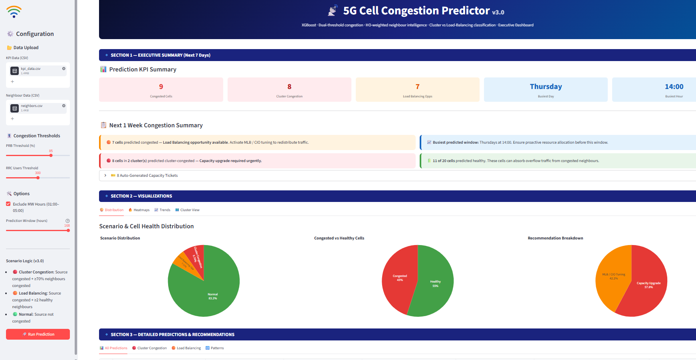

# 5G Congestion Predictor

> AI-driven 5G cell congestion prediction and SON (Self-Organising Network) recommendation dashboard — forecasts PRB/RRC congestion with XGBoost, classifies cluster vs load-balancing scenarios using neighbour-aware RF intelligence, and auto-generates capacity tickets via an interactive Streamlit dashboard.

---

## Screenshot



---

## Features

- **Congestion Prediction (ML)** — XGBoost classifier (RandomForest fallback if XGBoost unavailable) predicts the probability of PRB/RRC congestion per cell for up to 168 hours (1 week) ahead
- **Rich Temporal Feature Engineering** — hour/day/month cyclic encodings, peak-hour flags, lag features (previous hour, previous day same hour), and rolling PRB/RRC statistics (3h/6h/12h windows)
- **Dual-Threshold Congestion Target** — a cell is flagged congested if PRB utilisation OR average RRC users exceed configurable thresholds
- **MW-Hour Exclusion** — optional exclusion of maintenance-window hours (01:00–05:00) from training and prediction
- **Neighbour-Aware Scenario Classification**:
  - 🔴 **Cluster Congestion** — source cell congested AND ≥70% of HO-weighted neighbours also congested
  - 🟠 **Load Balancing Opportunity** — source cell congested AND ≥2 healthy neighbours available
  - 🟢 **Normal** — source cell not congested
- **Auto-Generated Capacity Tickets** — tickets created automatically for cluster-congestion scenarios with unique IDs
- **SON Recommendation Engine** — MLB (mobility load balancing), CIO tuning, capacity expansion, and sector-split suggestions per scenario
- **Recurring Pattern Detection** — identifies cells with repeated congestion at the same hour/day across the dataset
- **Executive Summary Dashboard** — KPI cards, pie charts (scenario distribution, congested vs healthy, recommendation breakdown), heatmaps (hour×day and per-cell congestion intensity), PRB/RRC/probability trend charts, and a cluster view (source cell + top-4 neighbours)
- **Detailed Predictions Section** with 4 tabs:
  - 📊 All Predictions
  - 🔴 Cluster Congestion
  - 🟠 Load Balancing
  - 🔁 Recurring Patterns

---

## Architecture

```
KPI CSV + Neighbour CSV (file upload)
        │
        ▼  validate_kpi_data()        — schema check, date-range, null checks
        │
        ▼  engineer_features()        — cyclic time encodings, lag/rolling features
        │
        ▼  define_target()            — congested = PRB > threshold OR RRC > threshold
        │
        ▼  train_model()              — XGBoost (or RandomForest fallback)
        │
        ▼  build_prediction_input()   — future timestamps × cells, hour-aware KPI imputation
        │
        ▼  predict_congestion()       — congestion_probability per cell/hour
        │
        ▼  classify_scenario()        — Cluster Congestion / Load Balancing / Normal
        │       (uses build_neighbor_map + build_ho_weight_map from neighbors.csv)
        │
        ▼  attach_recommendations()   — SON action suggestions per scenario
        │
        ▼  auto_generate_tickets()    — capacity tickets for Cluster Congestion cells
        │
        ▼  detect_recurring_patterns()
        │
        ▼  Streamlit Dashboard (Executive Summary + Detailed Predictions)
```

---

## Project Structure

```
5g-congestion-predictor/
├── app.py              # Streamlit dashboard — Executive Summary + Detailed Predictions
├── ml_pipeline.py       # Data validation, feature engineering, model training, prediction
├── neighbor_engine.py   # Neighbour map, HO-weighted scenario classification, SON recommendations
├── kpi_data.csv         # Sample KPI input data (timestamp, cell, gNB, PRB, RRC, throughput)
├── neighbors.csv        # Cell neighbour relationships with handover (HO) attempts
├── requirements.txt
└── .gitignore
```

---

## Data Format

### `kpi_data.csv`

| Column | Description |
|---|---|
| `timestamp` | Date/time of the KPI reading |
| `cell_name` | Cell identifier (e.g. `Cell_01`) |
| `gnb_name` | gNodeB identifier (e.g. `gNB_01`) |
| `prb_utilization` | PRB (Physical Resource Block) utilisation (%) |
| `avg_rrc_users` | Average number of RRC-connected users |
| `throughput_mbps` | Throughput in Mbps |

### `neighbors.csv`

| Column | Description |
|---|---|
| `cell_name` | Source cell identifier |
| `neighbor_cell` | Neighbour cell identifier |
| `ho_attempts` | Number of handover attempts between source and neighbour (used to weight top-4 neighbours) |

---

## Setup & Installation

### Prerequisites

- Python 3.12+
- pip

### 1. Clone the Repository

```bash
git clone https://github.com/<your-username>/5g-congestion-predictor.git
cd 5g-congestion-predictor
```

### 2. Install Dependencies

```bash
pip install -r requirements.txt
```

### 3. Run the App

```bash
streamlit run app.py
```

Open your browser at `http://localhost:8501`.

---

## Usage

1. In the sidebar, upload your **KPI Data (CSV)** and **Neighbour Data (CSV)** files (use `kpi_data.csv` and `neighbors.csv` to try the sample dataset).
2. Adjust the **Congestion Thresholds**:
   - PRB Threshold (%) — default 85
   - RRC Users Threshold — default 300
3. Configure **Options**:
   - Exclude MW Hours (01:00–05:00) — enabled by default
   - Prediction Window (hours) — up to 168h (1 week), recommended for the executive summary
4. The dashboard automatically:
   - Validates and engineers features from the uploaded data
   - Trains the congestion model (XGBoost or RandomForest fallback)
   - Generates a week-ahead prediction for every cell
   - Classifies each prediction into Cluster Congestion / Load Balancing / Normal using neighbour data
5. Review the **Executive Summary** (Section 1–2): KPI cards, distribution pies, heatmaps, trend charts, and cluster view.
6. Drill into **Detailed Predictions** (Section 3) across the 4 tabs — All Predictions, Cluster Congestion, Load Balancing, and Recurring Patterns.
7. Auto-generated capacity tickets appear for cells classified as Cluster Congestion.

### Scenario Logic (v3.0)

| Scenario | Condition |
|---|---|
| 🔴 **Cluster Congestion** | Source cell congested AND ≥70% of HO-weighted neighbours also congested |
| 🟠 **Load Balancing Opportunity** | Source cell congested AND ≥2 healthy neighbours (PRB and RRC both below threshold) |
| 🟢 **Normal** | Source cell not congested |

---

## Dependencies

| Package | Purpose |
|---|---|
| `streamlit` | Web UI framework |
| `pandas` | Data manipulation |
| `numpy` | Numerical computation |
| `plotly` | Interactive charts and heatmaps |
| `scikit-learn` | Train/test split, label encoding, metrics, RandomForest fallback |
| `xgboost` | Primary congestion classification model |
| `openpyxl` | Excel file support |
| `joblib` | Model serialisation |

> The pipeline automatically falls back to `RandomForestClassifier` from scikit-learn if `xgboost` is not installed.

---

## Future Enhancements

- FastAPI backend
- Docker deployment
- PostgreSQL integration
- Kafka streaming
- Kubernetes deployment
- Real-time prediction pipeline

---

## License

This project is provided for educational and demonstration purposes.
